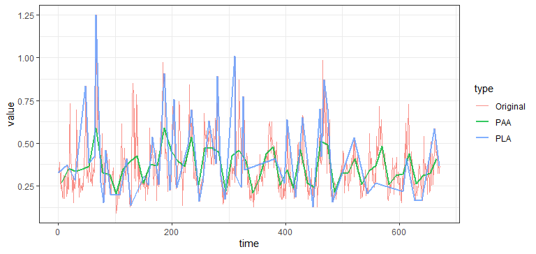

<!-- README.md is generated from README.Rmd. Please edit that file -->
TSrepr
======

[](https://travis-ci.org/PetoLau/TSrepr) [](https://cran.r-project.org/package=TSrepr) [](https://cran.r-project.org/package=TSrepr) [](https://cran.r-project.org/package=TSrepr) [](https://www.rpackages.io/package/TSrepr) [](https://codecov.io/github/PetoLau/TSrepr?branch=master) [](https://doi.org/10.21105/joss.00577)

TSrepr is R package for fast time series representations and dimensionality reduction computations. Z-score normalisation, min-max normalisation, forecasting accuracy measures and other useful functions implemented in C++ (Rcpp) and R.

Installation
------------

You can install **TSrepr** directly from [CRAN](https://CRAN.R-project.org/package=TSrepr):

``` r
install.packages("TSrepr")
```

Or development version from [GitHub](https://github.com/PetoLau/TSrepr) with:

``` r
# install.packages("devtools")
devtools::install_github("PetoLau/TSrepr")
```

Overview
--------

All type of time series representations methods are implemented, and these are so far:

-   Nondata adaptive:
    -   PAA - Piecewise Aggregate Approximation (`repr_paa`)
    -   DWT - Discrete Wavelet Transform (`repr_dwt`)
    -   DFT - Discrete Fourier Transform (`repr_dft`)
    -   DCT - Discrete Cosine Transform (`repr_dct`)
    -   SMA - Simple Moving Average (`repr_sma`)
    -   PIP - Perceptually Important Points (`repr_pip`)
-   Data adaptive:
    -   SAX - Symbolic Aggregate Approximation (`repr_sax`)
    -   PLA - Piecewise Linear Approximation (`repr_pla`)
-   Model-based:
    -   Mean seasonal profile - Average seasonal profile, Median seasonal profile, etc. (`repr_seas_profile`)
    -   Model-based seasonal representations based on linear (additive) model (LM, RLM, L1, GAM) (`repr_lm`, `repr_gam`)
    -   Exponential smoothing seasonal coefficients (`repr_exp`)
-   Data dictated:
    -   FeaClip - Feature extraction from clipping representation (`repr_feaclip`, `clipping`)
    -   FeaTrend - Feature extraction from trending representation (`repr_featrend`, `trending`)
    -   FeaClipTrend - Feature extraction from clipping and trending representation (`repr_feacliptrend`)

Additional useful functions are implemented as:

-   Windowing (`repr_windowing`) - applies above mentioned representations to every window of a time series
-   Matrix of representations (`repr_matrix`) - applies above mentioned representations to every row of a matrix of time series
-   Normalisation functions - z-score (`norm_z`), min-max (`norm_min_max`)
-   Normalisation functions with output also of scaling parameters - z-score (`norm_z_list`), min-max (`norm_min_max_list`)
-   Denormalisation functions - z-score (`denorm_z`), min-max (`denorm_min_max`)
-   Forecasting accuracy measures - MSE, MAE, RMSE, MdAE, MAPE, sMAPE, MAAPE, MASE

Usage
-----

``` r
library(TSrepr)
library(ggplot2)

data_ts <- as.numeric(elec_load[5,]) # electricity load consumption data
# Comparison of PAA and PLA
# Dimensionality of the time series will be reduced 8 times
data_paa <- repr_paa(data_ts, q = 12, func = mean)
data_pla <- repr_pla(data_ts, times = 55, return = "both") # returns both extracted places and values

data_plot <- data.frame(value = c(data_ts, data_paa, data_pla$points),
                        time = c(1:length(data_ts), seq(6, length(data_ts), by = 12),
                                 data_pla$places),
                        type = factor(c(rep("Original", length(data_ts)),
                                        rep(c("PAA", "PLA"), each = 56))))

ggplot(data_plot, aes(time, value, color = type, size = type)) +
  geom_line(alpha = 0.8) +
  scale_size_manual(values = c(0.6, 0.8, 0.8)) +
  theme_bw()
```



For more information
--------------------

-   Check my blog post at [petolau.github.io/TSrepr-time-series-representations](https://petolau.github.io/TSrepr-time-series-representations/),
-   Check my blog post about clustering time series representations at [petolau.github.io/TSrepr-clustering-time-series-representations](https://petolau.github.io/TSrepr-clustering-time-series-representations/).

Contact
-------

-   For any suggestions and comments write me an email at: <tsreprpackage@gmail.com>.
-   For contribution options, check [CONTRIBUTING.md](https://github.com/PetoLau/TSrepr/blob/master/CONTRIBUTING.md) file, please.

Citation
--------

Cite the package as:

-   Laurinec, (2018). TSrepr R package: Time Series Representations. Journal of Open Source Software, 3(23), 577, <https://doi.org/10.21105/joss.00577>
